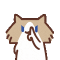
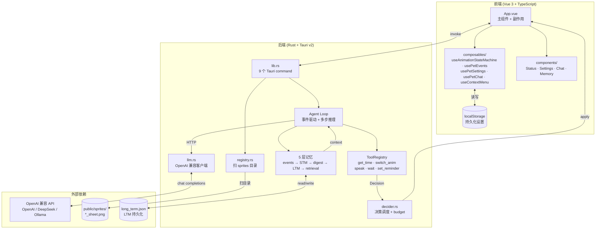

# 🦊 Desktop Pet

AI 桌面宠物 — 基于 **Tauri v2 + Vue 3 + TypeScript** 的透明、无边框、置顶桌面精灵。

一个住在你桌面上的小家伙：LLM 驱动行为，自主观察、记忆、聊天、设提醒，并通过 11 个动画表达情绪与状态。


---

## ✨ 本版亮点（v0.1.2 → 下一个 release）

- 🎭 **11 个动画**：从 3 个扩到 11 个，覆盖害羞、点赞、紧张、睡觉、偷看、踩奶、心动、走神等状态
- ⏰ **定时提醒**：宠物可以记下"5 分钟后叫我吃饭"，到时间主动说
- 💬 **主动聊天**：无交互时根据时间/场景自主发起对话
- 🧠 **空调用退避**：连续空响应自动降频，避免 LLM 浪费
- 🗜️ **右键菜单精简**：去掉"手动切动画"子菜单（用户向 LLM 让步，让它来选）

---

## 🎯 核心能力

### LLM 驱动

- **OpenAI 兼容 API**：支持 OpenAI / DeepSeek / Ollama / vLLM / Azure 等
- **ReAct 范式**：记忆 → 推理 → 工具调用 → 行动
- **工具系统**：`get_current_time` / `switch_animation` / `speak_to_user` / `wait` / `set_reminder`，统一 function calling
- **可配置人格 + 宠物名称**：从设定面板改，立即生效

### 记忆

- **5 层架构**：事件流 → 短期记忆（ring buffer，100 条 / 2 小时）→ 消化引擎 → 长期记忆（JSON 持久化）→ 检索注入
- **事件合并**：同类型连续事件自动压缩，减少 LLM 输入 token
- **Agent Loop**：事件驱动决策，支持多步推理

### 交互

- **右键菜单**：宠物状态 / 设定 / 对话 / 记忆 / 退出
- **左键短按读剪贴板**：自动打开对话并带上选中文字
- **主动聊天**：空闲时主动发起对话（`proactiveIntervalMs` / `minSilenceMs` 可配）
- **定时提醒**：通过 `set_reminder` 工具创建，前端维护最多 5 条

### 跨平台

- **Linux**：`.deb` / `.AppImage`
- **macOS**：`.dmg` / `.app`（含 universal）
- **Windows**：`.msi` / `.exe`
- CI 自动构建并随 tag `v*` 发布

---

## 🎭 动画库

放在 `public/sprites/raw/` 下的 GIF 经 `gif-to-sheet` skill 转为横排 sprite sheet。

| 预览 | 英文 ID | 含义 | 单帧 | 帧数 | FPS | 循环 |
|---|---|---|---|---|---|---|
|  | `touch_nose` | 捂鼻子 | 240×240 | 28 | 25 | infinite |
|  | `think` | 发呆 | 155×155 | 26 | 25 | infinite |
|  | `poop` | 拉屎 | 155×155 | 121 | 25 | once |
|  | `shush` | 嘘（捂嘴） | 120×120 | 2 | 50 | once |
|  | `thumbs_up` | 点赞 | 120×120 | 9 | 20 | once |
|  | `nervous` | 紧张流汗 | 155×155 | 13 | 25 | infinite |
|  | `sleep` | 睡觉 | 120×120 | 31 | 25 | infinite |
|  | `peek` | 偷看 | 120×120 | 57 | 20 | infinite |
|  | `knead` | 踩奶 | 240×240 | 3 | 25 | infinite |
|  | `heartbeat` | 心动 | 155×155 | 6 | 25 | infinite |
|  | `cloud` | 走神（一切都是浮云） | 120×120 | 32 | 25 | infinite |

**循环规则**：手势类（shush / thumbs_up）= once，状态类 = infinite。

新增动画只需要：
1. 把 GIF 丢到 `public/sprites/raw/<中文名>.gif`
2. 跑 `bash .claude/skills/gif-to-sheet/scripts/gif-to-sheet.sh <english-id> <中文名>.gif`
3. 在 `src-tauri/src/registry.rs` 的 `known_meta()` 加一行
4. 在 `src/types/pet.ts` 的 `AnimationId` union 加一项

---

## 🏗️ 架构



**关键路径**：

1. **用户操作**：`App.vue` 接事件 → `pushEvent()` 入队 → `usePetEvents` 按规则 flush → `agent_decide` 命令
2. **决策循环**：Agent Loop 收 events → 注入 memory context → 调 LLM → LLM 选工具 → Rust 执行 → terminal 工具直接返 Decision，非终端喂回 LLM 继续
3. **动画切换**：`Decision::Switch` → `useAnimationStateMachine.dispatch` → 切 CSS `background-position` 帧动画
4. **持久化**：用户设定 → localStorage；长期记忆 → `long_term.json`

**设计原则**：
- **R7**：Rust 是数据结构的唯一源，TS 端手写镜像（`// Mirrored from ...` 注释）
- **状态机是纯函数 reducer**：副作用（preload / setSize / 切 CSS）全在 `App.vue` 的 watcher
- **工具系统是 terminal / 非终端二分**：terminal 工具结果直接当 `Decision` 返回

---

## 🚀 快速开始

### 前置要求

- Node.js ≥ 18
- Rust stable（`rustup` 安装）
- 平台依赖：见 [Tauri v2 文档](https://v2.tauri.app/start/prerequisites/)

### 开发

```bash
# 1. 装依赖
npm install

# 2. 配 LLM（可选，不配也能跑，默认人格）
cp .env.example .env
# 编辑 .env 填入 LLM_API_KEY

# 3. 启动（Vite + Tauri 一起跑）
npm run tauri dev
```

### 生产构建

```bash
npm run tauri build
# 产物在 src-tauri/target/release/bundle/
```

### 类型检查

```bash
# 前端
npx vue-tsc --noEmit

# 后端
cd src-tauri && cargo check
```

---

## ⚙️ 环境变量

复制 `.env.example` 为 `.env` 并配置：

| 变量 | 必填 | 说明 |
|---|---|---|
| `LLM_API_KEY` | ✅ | OpenAI 兼容 API 密钥（留空自动禁用 LLM） |
| `LLM_API_ENDPOINT` | | 完整 chat completions URL，默认 `https://api.openai.com/v1/chat/completions` |
| `LLM_MODEL` | | 模型名，默认 `gpt-4o-mini` |
| `LLM_TEMPERATURE` | | 0-2，默认 0.7 |
| `LLM_MAX_TOKENS` | | 默认 256 |
| `LLM_SYSTEM_PROMPT` | | 完整替换默认宠物人格 prompt |
| `LLM_ENABLED` | | `true` / `false`，覆盖自动检测 |

支持 DeepSeek、Ollama、Azure OpenAI、vLLM 等任何 OpenAI 兼容服务。

---

## 📋 Specs 路线图

所有 spec 在 `docs/specs/` 下，按 SDD 流程（`sdd` skill）DRAFT → FROZEN → DONE。

| Spec | 名称 | 状态 |
|---|---|---|
| [01](docs/specs/01-pet-interaction-layer.md) | 宠物交互层（多动画 + 状态机 + 右键菜单 + 窗口自适应） | ✅ DONE |
| [02](docs/specs/02-llm-decision.md) | LLM 状态决策（OpenAI 兼容 API + 宠物管理中心 + 可配置人格） | 📝 DRAFT |
| [03](docs/specs/03-agent-loop.md) | Agent Loop + 事件驱动决策 | ❄️ FROZEN |
| [04](docs/specs/04-event-compaction.md) | 事件合并 + 摘要压缩 | ✅ DONE |
| [05](docs/specs/05-reminder-proactive-chat.md) | 定时提醒 + 空调用退避 + 主动聊天 | ✅ DONE |

待规划：桌面感知、文字选区操作、长期记忆深化、跨设备同步。

---

## 🛠️ 技术栈

| 层 | 技术 |
|---|---|
| 桌面框架 | Tauri v2 (Rust) |
| 前端 | Vue 3 + TypeScript + Vite |
| LLM | OpenAI 兼容 API（function calling） |
| 状态机 | 纯函数 reducer（playing / idle / transitioning） |
| 短期记忆 | VecDeque ring buffer（100 条 / 2 小时） |
| 长期记忆 | JSON 文件 + 关键词检索 |
| 精灵图 | GIF → ffmpeg → 横排 PNG + CSS `steps()` |
| CI/CD | GitHub Actions（Linux / macOS / Windows 三平台） |

---

## 🤖 配套的开发工具

项目带一套 SDD + 记忆系统，让 Claude 持续参与：

- **`.claude/skills/sdd/`** — Spec-Driven Development 工作流（任何新功能都先走 spec）
- **`.claude/skills/gif-to-sheet/`** — GIF → sprite sheet 转换
- **`.claude/skills/p8-engine/`** — 工程方法论（先澄清再动手）
- **`memory/`** — 跨会话记忆（4 个模块 + 进度 + 踩过的坑）

---

## 📦 跨平台发布

```bash
# 打 tag 即触发 CI 自动构建 + Release
git tag v0.2.0
git push origin v0.2.0
```

CI 在 [`.github/workflows/`](.github/workflows/) 下，产物：
- Linux: `.deb` / `.AppImage`
- macOS: `.dmg` / `.app`（含 x86_64 + arm64 universal）
- Windows: `.msi` / `.exe`

---

## 📂 项目结构

```
desktop-pet/
├── src/                      # Vue 3 前端
│   ├── App.vue
│   ├── components/           # 4 个 overlay 面板
│   ├── composables/          # 6 个组合式
│   └── types/pet.ts          # TS 镜像
├── src-tauri/                # Rust 后端
│   └── src/
│       ├── lib.rs            # Tauri commands
│       ├── types.rs          # 共享 serde 结构
│       ├── registry.rs       # 动画注册表
│       ├── tools.rs          # ToolRegistry
│       ├── llm.rs            # OpenAI HTTP 客户端
│       ├── decider.rs        # 决策调度
│       ├── agent/            # Agent Loop
│       ├── memory/           # 5 层记忆
│       └── chat.rs           # 对话处理
├── public/sprites/           # 精灵图
│   ├── raw/                  # 源 GIF（保留中文名）
│   └── *_sheet.png           # 生成的横排 sprite sheet
├── docs/specs/               # 6 个 spec
├── memory/                   # AI 跨会话记忆
├── .claude/skills/           # sdd / gif-to-sheet / p8-engine
├── .claude/                  # hooks + settings
├── CLAUDE.md                 # Claude Code 项目说明
└── README.md                 # 你正在看这个
```

---

## 📜 License

MIT

---

## 🙏 致谢

- 灵感：经典桌面宠物（QQ 宠物、番茄钟小助手）
- 动画素材：网络收集的可爱猫 GIF
- LLM：OpenAI / DeepSeek / Ollama
